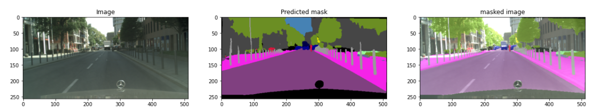
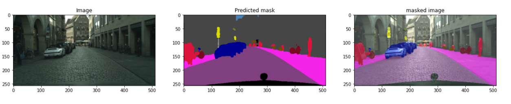
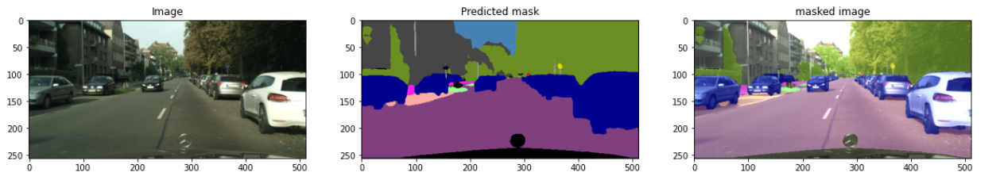

# Semantic_segmentation-architectures


## Project Description

This is  repository contains the implementation of Unet and Hrnet architecture
for semantic segmentation

They are trained on Cityscapes and Kitti benchmark dataset and evaluated 
on Camvid and test data from city scapes and kitii

## Dataset

[you can download dataset from here](https://drive.google.com/drive/folders/194wCb_YXeb0hSrTvm513V7-JYOLrauUj?usp=sharing)


## Screenshots






## Acknowledgements

 - [hrnet paper](https://arxiv.org/pdf/1904.04514.pdf)
 - [Unet paper](https://arxiv.org/pdf/1505.04597.pdf)
 


## Installation

Install my-project with requirements

```bash
 pip install -r requirements.txt
```
    
